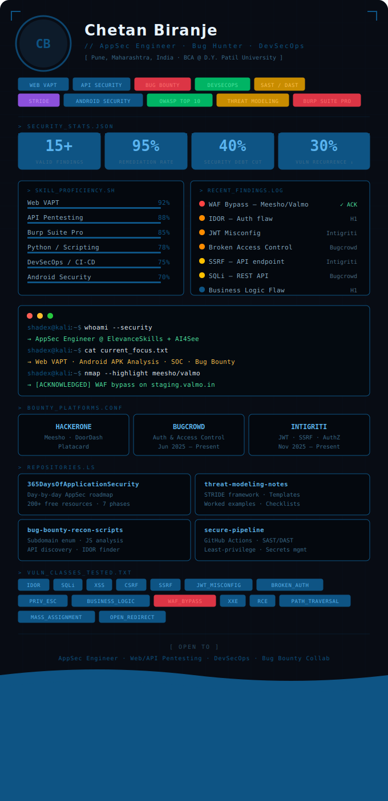

<div align="center">
  
</div>


</div>

<div align="center">

[](https://linkedin.com/in/chetanbiranje)
[](https://hackerone.com)
[](https://bugcrowd.com)
[](https://intigriti.com)
[](mailto:chetanbiranje@proton.me)
[](https://ChetanBiranje.replit.app)

</div>

<div align="center">


</div>

---

```python
class ChetanBiranje:

    role      = "Application Security Engineer"
    handles   = ["Chetan-Biranje", "mr-Shadex"]
    location  = "Pune, Maharashtra, India"
    education = "BCA @ D.Y. Patil University (2025–2028)"

    current_roles = [
        "Cyber Security Analyst  @ ElevanceSkills  (Mar 2026–Present)",
        "Full-Stack Dev (AppSec) @ AI4See           (Dec 2025–Present)",
    ]

    bug_bounty = {
        "HackerOne" : ["Meesho/Valmo ← WAF bypass ACKNOWLEDGED ✓", "DoorDash", "Platacard"],
        "Bugcrowd"  : ["Auth & access control — Jun 2025–Present"],
        "Intigriti" : ["JWT misconfiguration, SSRF, authorization flaws"],
    }

    stats = {
        "valid_findings"     : "15+",
        "remediation_rate"   : "95%",
        "security_debt_cut"  : "40%",
        "vuln_recurrence_cut": "30%",
    }
```

---

## `$ cat security_stats.json`

<div align="center">

| 🎯 Valid Findings | ✅ Remediation Rate | 📉 Security Debt Cut | 🔁 Vuln Recurrence ↓ |
|:---:|:---:|:---:|:---:|
| **15+** | **95%** | **40%** | **30%** |

</div>

---

## `$ ./recon.sh --show highlights`

```
[CRITICAL] WAF bypass — staging.valmo.in     → Meesho Security Team: ACKNOWLEDGED ✓
[HIGH]     IDOR — broken object-level auth   → HackerOne: VALID ✓
[HIGH]     JWT algorithm confusion            → Intigriti: VALID ✓
[HIGH]     Broken access control             → Bugcrowd: VALID ✓
[HIGH]     Privilege escalation via IDOR     → HackerOne: VALID ✓
[MEDIUM]   SSRF — internal API endpoint      → Intigriti: VALID ✓
[MEDIUM]   SQL injection — REST API          → Bugcrowd: VALID ✓
[MEDIUM]   Business logic — checkout bypass  → HackerOne: VALID ✓
```

---

## `$ nmap --vulnerability-classes`

<div align="center">


</div>

---

## `$ cat toolchain.conf`

<div align="center">

| Security Testing | Recon & OSINT | DevSecOps | Programming |
|---|---|---|---|
| Burp Suite Pro | subfinder | GitHub Actions | Python |
| OWASP ZAP | amass | Docker | JavaScript |
| Nmap | httpx | Bandit / Semgrep | Node.js |
| ffuf | waybackurls | CodeQL | Bash |
| SQLmap | gau | detect-secrets | SQL |
| Nikto | Shodan | Trivy | PowerShell |
| JADX / MobSF / Frida | Nuclei | SAST / DAST | — |
| Wireshark | jwt_tool | Gitleaks | — |

</div>

---

## `$ ls -la repositories/`

<div align="center">

| Repository | Description | Stack |
|---|---|---|
| [🗺️ 365 Days AppSec Roadmap](https://github.com/Chetan-Biranje/365DaysOfApplicationSecurityRoadmap) | Day-by-day roadmap · 200+ free resources · 7 phases | Open Source |
| [🛡️ Threat Modeling Notes](https://github.com/Chetan-Biranje/threat-modeling-notes) | STRIDE · Templates · Worked examples · Checklists | Markdown |
| [🔍 Bug Bounty Recon Scripts](https://github.com/Chetan-Biranje/bug-bounty-recon-scripts) | Subdomain enum · JS analysis · API discovery · IDOR finder | Python · Bash |
| [⚙️ Secure CI/CD Pipeline](https://github.com/mr-Shadex/secure-pipeline) | GitHub Actions · SAST/DAST · Least-privilege | GitHub Actions |
| [🔐 Secure REST API + RBAC](https://github.com/mr-Shadex/secure-rbac-api) | JWT auth · Role inheritance · Security headers | Node.js · MongoDB |
| [🤖 API Security Toolkit](https://github.com/mr-Shadex/api-security-toolkit) | JWT analysis · IDOR detection · Fuzzing | Python |

</div>

---

## `$ github-stats --user Chetan-Biranje`

<div align="center">


</div>

---

## `$ cat certifications.txt`

```
✓ Linux Fundamentals              — TCM Security
✓ Application Security Training  — DevTown
✓ SOC Analyst                    — USLA
✓ Dark Web                       — USLA
✓ Introduction to Cybersecurity  — Commonwealth Bank (Job Simulation)
✓ Shields Up: Cybersecurity      — AIG (Job Simulation)
✓ Cyber Job Simulation           — Deloitte Australia
✓ Microsoft AI Classroom         — Microsoft
✓ MongoDB Basics
✓ Node.js + Express + MongoDB    — Udemy
```

---

<div align="center">

```
╔═══════════════════════════════════════════════════════════╗
║  [ OPEN TO ]                                              ║
║  Application Security Engineer                            ║
║  Web & API Penetration Testing                            ║
║  DevSecOps                                                ║
║  Bug Bounty Collaborations                                ║
╚═══════════════════════════════════════════════════════════╝
```


</div>
